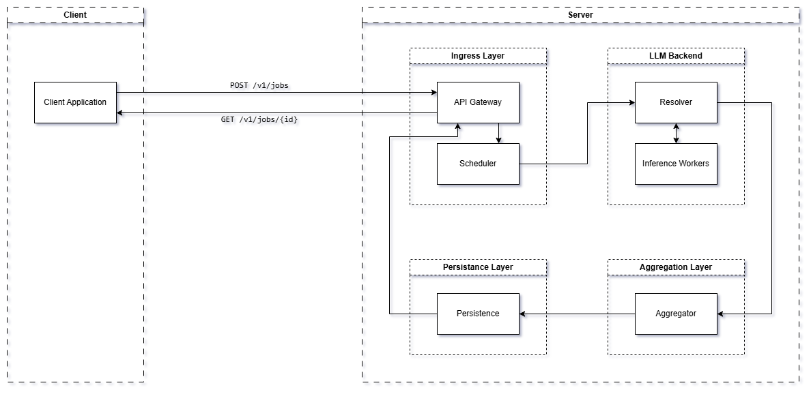

# LLMux
LLMux is a lightweight, self-hosted asynchronous LLM response aggregator for running prompts through multiple LLMs and aggregating their response. It gives users configuration-level control over the models and aggregation strategy they use. 

Its purpose is to reduce reliance on one model's perspective bias. By combining outputs from several different models in a ensemble-like strategy, LLMux can provide more robust responses.

## How it works
LLMux lets user submit requests containing their prompt. Then, the backend processes the request using N configured worker models that provide base responses for the user prompt, resulting in N outputs. These outputs are then aggregated based on the chosen aggregation strategy and the final output is provided. 

## Architecture


## Quick start
### Local start

For using Ollama backend, local development requires Python 3.14+, [`uv`](https://docs.astral.sh/uv/), Docker, and Docker Compose. Compose is used to run PostgreSQL and Ollama; the API itself runs from the local `uv` environment.

From the project root, start the supporting services:

```bash
cp .env.example .env
cp llmux/.env.example llmux/.env
docker compose up -d db ollama
```

Update `llmux/core/config.json` if needed.


Then start the API from the `llmux` directory:

```bash
cd llmux
uv sync
uv run alembic upgrade head
uv run uvicorn main:app --reload --host 0.0.0.0 --port 8000
```

The API is available at `http://localhost:8000`.

### Docker support

Docker Compose starts PostgreSQL, Ollama, database migrations, and the LLMux API. From the project root, create the environment file and change its values as needed:

```bash
cp .env.example .env
docker compose up -d --build
```

Pull the configured models into the Compose-managed Ollama service:

The API is exposed on port `8000` by default; set `LLMUX_PORT` in `.env` to use another host port. 

Ollama is exposed on `localhost:11434` for local development. 

For a remote machine, copy the repository to the server and run the same Compose commands there.

## API usage

LLMux exposes an asynchronous REST API. Once the application is running, interactive documentation is available at:

- Swagger UI: `http://localhost:8000/docs`
- ReDoc: `http://localhost:8000/redoc`
- OpenAPI specification: `http://localhost:8000/openapi.json`

### Submit a job

Submit a prompt with `POST /api/v1/jobs`:

```bash
curl -X POST http://localhost:8000/api/v1/jobs \
  -H "Content-Type: application/json" \
  -d '{"text":"Explain how neural networks work."}'
```

The API responds immediately with a job ID:

```json
{
  "id": "job-id"
}
```

### Get a job result

Use the returned ID with `GET /api/v1/jobs/{job_id}`:

```bash
curl http://localhost:8000/api/v1/jobs/job-id
```

The job is processed asynchronously. Check the `done` field; when it is `true`, the completed response is available in the `response` field.

## Configuration
Configuration can be found under [`config.json`](llmux/core/config.json). 

### Configuration details:
- `total_workers`: Number of worker models to provide base responses. *Important*: Must match the number of models in `models.workers`.
- `llm_engine`: LLM backend used by the application, such as `ollama`. Currently supported: `ollama`.
- `models.workers`: List of models used to generate candidate responses.
- `models.aggregator`: Model used to combine the worker responses.
- `aggregation_strategy`: Method used to combine responses, such as `judge`. Currently supported `judge`.
- `aggregation_system_prompt`: Instructions given to the aggregator model. 
- `generation_timeout_s`: Maximum time allowed for LLM generation, in seconds.
- `max_prompt_length_char`: Maximum prompt length, measured in characters.
- `max_concurrent_jobs`: Maximum number of jobs processed simultaneously.
- `max_queued_jobs`: Maximum number of jobs waiting in the queue.

## Project status
The project is suitable for local development and self-hosted Docker deployments.

### Current status

- [x] Asynchronous API for submitting and polling LLM jobs.
- [x] Configurable Ollama worker models with judge-based response aggregation.
- [x] Ollama backend integration with automatic model pulling.
- [x] PostgreSQL persistence for jobs, outputs, metrics, failures, conversations, and request logs.
- [x] Configurable aggregation strategy and system prompt.
- [x] Automatic model discovery and pulling when required.
- [x] Local `uv` development workflow.
- [x] Docker Compose setup for the API, PostgreSQL, Ollama, and migrations.
- [x] Alembic migrations, locked dependencies, and a test suite.

### Known limitations

- [ ] Job execution is single-process and not durable across restarts.
- [ ] Ollama is the only backend, and worker models run sequentially.
- [ ] Only judge-based aggregation strategy supported and prompt requires better handling and aggregation hardening is needed.
- [ ] Prompt formatting, aggregation input protection, and context limits need improvement.
- [ ] The API updates currently relies on polling.

### Roadmap

- [ ] Durable, scalable, and transactional job execution.
- [ ] Safer prompts and additional aggregation strategies.
- [ ] More inference backends and optional parallel execution.
- [ ] Real-time updates, observability, and client tooling.
- [ ] Automated releases and deployment.
